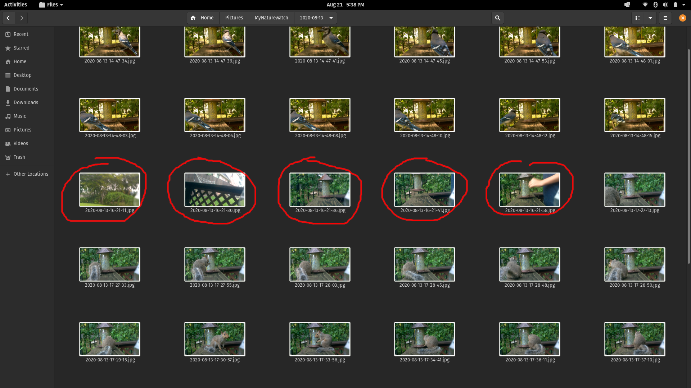

# MyNaturewatch Convolutional Neural Network

## Date 

August 2020. During COVID lockdown, summer (no school).

## Problem

The [MyNaturewatch DIY camera](https://mynaturewatch.net/daylight-camera-instructions) is a great DIY wildlife camera I made during COVID lockdown. It uses a Raspberry Pi Zero and a Pi Zero camera + sensor to detect when there is movement and takes a picture of it. 

The problem is, more often than not, the camera takes pictures of anything that moves like leaves. I find myself scrolling through an endless gallery of nothing and there are very few pictures of actual animals. This network solves that problem.


How should a computer know what picture to keep, and which one to discard?

## What does this program do?

- Download all the photos from the Naturewatch Camera (RasPi)
- Classify them
- Make directories based on the dates of the animal pictures in the ~/Pictures folder in your host machine
- Delete the photos with no animals on it

## Result

This is just an example of the output. The number of non-animal photos has been reduced by a lot (out of 100 pictures, 5 false positives).

Best test accuracy: 98.2%



## Dataset

The dataset contains 372 pictures of animals and 1,934 pictures of other things (non-animals). It was compiled using pictures I took with my camera, and scraping some off the internet.

There is an obvious bias in the dataset; the non-animal pictures outnumber the animal pictures 5 to 1. This teaches the model that there are more non-animal pictures and that animal pictures are rarer.

## Tech stack

- Python3
- Keras/TensorFlow API
- SCP/SSH
- Python OpenCV
- NumPy
- Matplotlib

## Network

I'm using a custom neural network for now.

```
Model: "sequential"
_________________________________________________________________
Layer (type)                 Output Shape              Param #   
=================================================================
conv2d (Conv2D)              (None, 68, 120, 32)       896       
_________________________________________________________________
activation (Activation)      (None, 68, 120, 32)       0         
_________________________________________________________________
batch_normalization (BatchNo (None, 68, 120, 32)       128       
_________________________________________________________________
dropout (Dropout)            (None, 68, 120, 32)       0         
_________________________________________________________________
conv2d_1 (Conv2D)            (None, 66, 118, 32)       9248      
_________________________________________________________________
activation_1 (Activation)    (None, 66, 118, 32)       0         
_________________________________________________________________
batch_normalization_1 (Batch (None, 66, 118, 32)       128       
_________________________________________________________________
max_pooling2d (MaxPooling2D) (None, 33, 59, 32)        0         
_________________________________________________________________
conv2d_2 (Conv2D)            (None, 33, 59, 64)        18496     
_________________________________________________________________
activation_2 (Activation)    (None, 33, 59, 64)        0         
_________________________________________________________________
batch_normalization_2 (Batch (None, 33, 59, 64)        256       
_________________________________________________________________
dropout_1 (Dropout)          (None, 33, 59, 64)        0         
_________________________________________________________________
conv2d_3 (Conv2D)            (None, 31, 57, 64)        36928     
_________________________________________________________________
activation_3 (Activation)    (None, 31, 57, 64)        0         
_________________________________________________________________
batch_normalization_3 (Batch (None, 31, 57, 64)        256       
_________________________________________________________________
max_pooling2d_1 (MaxPooling2 (None, 15, 28, 64)        0         
_________________________________________________________________
flatten (Flatten)            (None, 26880)             0         
_________________________________________________________________
dense (Dense)                (None, 64)                1720384   
_________________________________________________________________
activation_4 (Activation)    (None, 64)                0         
_________________________________________________________________
dropout_2 (Dropout)          (None, 64)                0         
_________________________________________________________________
dense_1 (Dense)              (None, 64)                4160      
_________________________________________________________________
activation_5 (Activation)    (None, 64)                0         
_________________________________________________________________
dropout_3 (Dropout)          (None, 64)                0         
_________________________________________________________________
dense_2 (Dense)              (None, 2)                 130       
_________________________________________________________________
activation_6 (Activation)    (None, 2)                 0         
=================================================================
Total params: 1,791,010
Trainable params: 1,790,626
Non-trainable params: 384
_________________________________________________________________
```

## Disclaimer

I am not part of the MyNaturewatch team. I am just a kid learning about machine learning.